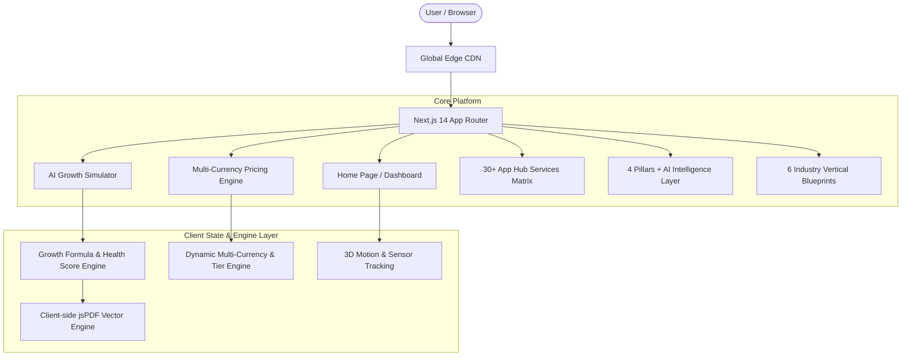

# Automataiz™ System Architecture & Technical Specifications

This document outlines the software architecture, data flow, mathematical modeling engine, and component hierarchy of the **Automataiz AI Business Operating System**.

---

## 1. System Architecture

Automataiz is structured as a full-stack Next.js application leveraging modern React 18 / Next.js 14 paradigms with hybrid static pre-rendering and client-side interactive telemetry.

---

## 2. The 4 Foundational Pillars + Central AI Layer

Automataiz unites the four core pillars of business execution into a single, cohesive operating loop:

| Pillar | Focus | Key Services | Metric Objective |
| :--- | :--- | :--- | :--- |
| **Marketing OS** | Demand Generation | Funnel Builder, Website Builder, AI Social, Ad Launcher, SEO Engine | Predictable Inbound Volume |
| **Sales OS** | Revenue Conversion | Unified CRM, Telecalling IVR, Deal Pipelines, Lead Scoring | High Win Rate & Velocity |
| **Operations OS** | Service Delivery | Workflow Visual Automation, HRM & Attendance, Tasks, Unified Inbox (WhatsApp WABA) | Operational Excellence & Zero Bottlenecks |
| **Finance OS** | Financial Health | Subscription Billing, Autopay UPI, Automated Invoicing, Real-Time CAC/LTV | Maximized Profit Margin |
| **AI Intelligence Layer** | Autonomous Co-Pilot | Nova AI Co-Pilot, SOP Autonomous Agents, Executive Telemetry Briefings | 24/7 Digital Workforce |

---

## 3. Mathematical Modeling in the Growth Simulator™

The AI Business Growth Simulator (`components/growth-simulator.tsx`) evaluates financial and operational metrics using the following algorithmic framework:

### A. Health Score Algorithm ($0 - 100$)
$$\text{Efficiency} = \min\left(100, \max\left(10, \frac{\text{Conversion Rate}}{15} \times 40 + \frac{100 - \text{Hours Wasted}}{100} \times 30 + \text{Profit Margin} \times 30\right)\right)$$

$$\text{Growth Score} = \text{round}\left(\text{Efficiency} \times 0.95 + \text{Bonus}\right)$$

- **Green Status ($\ge 75$)**: Optimal operating leverage with scalable systems.
- **Yellow Status ($50 - 74$)**: Moderate friction; significant pipeline leakage.
- **Red Status ($< 50$)**: High fragmentation, delayed response times, and severe revenue loss.

### B. Revenue Leak Calculations
- **Monthly Revenue Leak**:
  $$\text{Lost Revenue} = \text{Monthly Revenue} \times (1 - \text{Efficiency}) \times 0.35$$
- **Annual Lost Revenue**:
  $$\text{Annual Lost} = \text{Lost Revenue} \times 12$$
- **Leads Lost Due to Slow Follow-up**:
  $$\text{Leads Lost} = \text{Monthly Leads} \times (1 - \text{Lead Conversion Rate}) \times \text{Followup Delay Factor}$$

---

## 4. Multi-Currency Pricing Engine (`components/pricing-section.tsx`)

The pricing engine dynamically switches between currencies with live numerical formatting:
- **INR Mode**: Formatted according to the Indian numbering system (`₹XX,XXX / mo` or `₹X.X Lakhs`).
- **USD Mode**: Calculated with localized purchasing power pricing (`$XX / mo`).
- **Annual Billing Discount**: 20% savings calculated and displayed live across all 4 tiers:

$$\text{Annual Price Per Month} = \text{Monthly Price} \times 0.80$$

---

## 5. Client-Side PDF Report Generator (`lib/audit-generator.ts`)

The PDF audit generator runs completely client-side in the browser:
- Built with **jsPDF** and **jsPDF-AutoTable**.
- Generates a multi-page executive document complete with:
  1. Executive Summary & Calculated Growth Score.
  2. 4-Pillar Revenue Leak Diagnosis.
  3. CAC Reduction & ROI Action Plan.
  4. 90-Day Implementation Roadmap.
- Downloads directly to the user's machine without any server latency.

---

## 6. Performance & Responsive Design

- **Typography**: Responsive root font size (`16px` mobile, `17px` desktop) configured in `app/globals.css`.
- **Hardware Acceleration**: 3D tilt perspective animations utilize CSS `transform: translate3d()` and Framer Motion spring physics.
- **Responsive Layout**: Tested across all mobile viewports ($375\text{px} - 430\text{px}$), tablets ($768\text{px} - 1024\text{px}$), and ultra-wide displays ($1440\text{px}+$ ).
